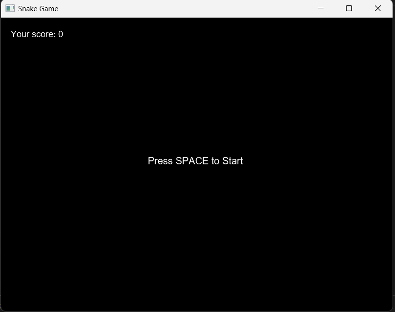
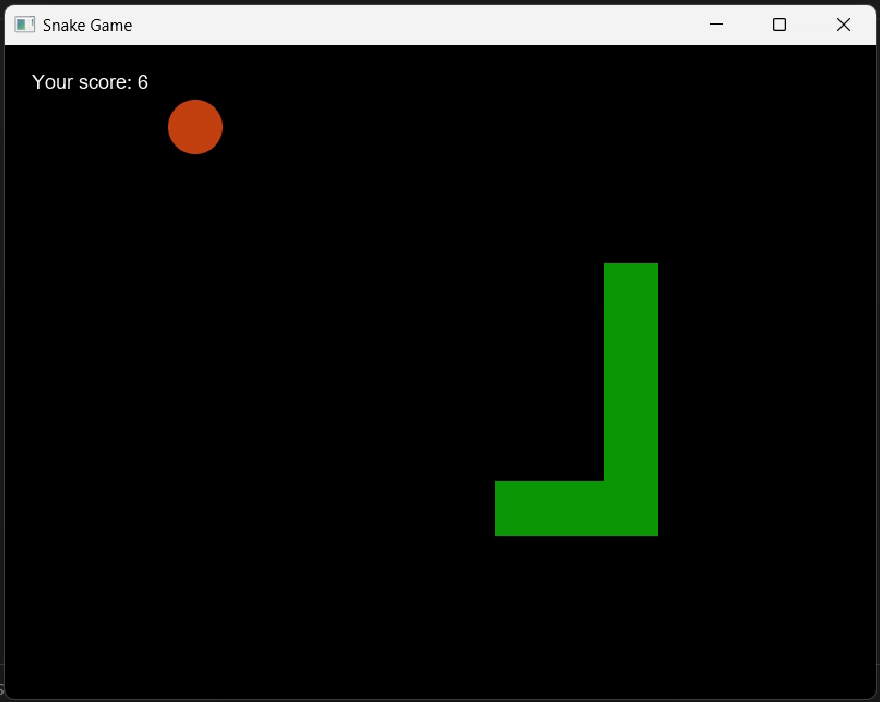
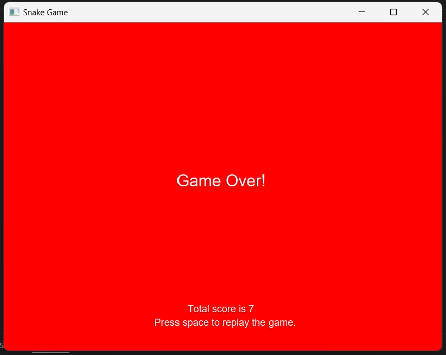

# SnakeGame

A simple **Snake Game** implemented in Java using JavaFX. Control the snake with the arrow keys and try to eat as much food as possible. The game ends if you hit the wall or your own body.

---

## Features

* Graphical interface with JavaFX
* Control with arrow keys
* Score counter
* Clean and simple source code (ideal as a small project/demo)

---

## Requirements

* Java 11 or higher (OpenJDK / Oracle JDK)
* JavaFX library (install separately if not included with your JDK)

> Note: This project is intended to run locally. You can use an IDE such as IntelliJ IDEA, Eclipse, or VSCode.

---

## Installation (Step by Step)

1. Clone the repository:

```bash
git clone https://github.com/begumsudeuslu/SnakeGame.git
cd SnakeGame
```

2. Open the project in your IDE (`File -> Open`) and set the `src` folder as your source directory.

3. If JavaFX is not installed, add the JavaFX libraries to your system. You may need to provide VM arguments such as:

```bash
--module-path /path/to/javafx/lib --add-modules javafx.controls,javafx.fxml
```

4. Run the `main` class (via Run in your IDE). If running from the command line, compile and run using `javac`/`java` and include the JavaFX libraries.

---

## How to Play (Controls)

* Arrow keys: Move the snake
* Goal: Collect food, survive as long as possible, and achieve a high score

---

## Screenshots

Screenshots are located in the `screenshots/` folder of this repository.








---

## Project Structure

* `src/` : Source code of the game
* `screenshots/` : Game screenshots

You can easily extend this project by adding features like speed boosts, obstacles, or level systems.

---

## Contributing

Feel free to contribute to this project. Open pull requests for new features, bug fixes, or improvements.

---

## Help / FAQ

* **JavaFX not found error**: Ensure your JavaFX libraries are in the correct path and included in VM arguments with `--module-path`.
* **Run issues**: Verify that the `src` directory is marked as a source root in your IDE.

---

